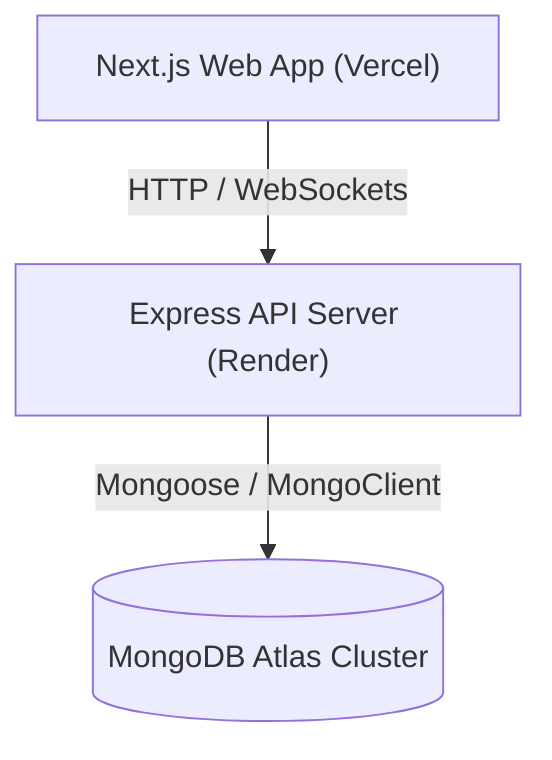

# Deployment Guide

This guide details the steps required to deploy the 52Archive stack using MongoDB Atlas (for persistence), Render (for the Express API server), and Vercel (for the Next.js web application).

## Architecture Overview



---

## 1. Database Setup: MongoDB Atlas

Since 52Archive uses structured rule schemas and versioned graphs, MongoDB's document-based model is a natural fit for storing the JSON-like game structures.

### Step-by-Step Setup
1. Log in to the [MongoDB Atlas Console](https://cloud.mongodb.com/).
2. Create a new project and provision a shared cluster (e.g., M0 Free Tier).
3. Under **Database Access**, create a database user with read/write access.
4. Under **Network Access**, whitelist `0.0.0.0/0` (or add Render's outbound IP ranges if using a static outbound proxy) to allow incoming connections from the backend.
5. Navigate to **Database**, click **Connect**, select **Drivers**, and copy the connection string. It should look like:
   ```env
   MONGODB_URI=mongodb+srv://<username>:<password>@cluster0.xxxx.mongodb.net/52archive?retryWrites=true&w=majority
   ```

### Document Schema Mapping
If migrating from the PostgreSQL schema defined in the SQL initialization scripts:
- **`games` collection**: Matches the `games` table.
  ```json
  {
    "_id": "game-id-slug",
    "title": "Game Title",
    "subtitle": "Subtitle",
    "summary": "One-line summary",
    "minPlayers": 2,
    "maxPlayers": 6,
    "playTimeMinutes": 30,
    "difficulty": "moderate",
    "tags": ["classic", "strategy"],
    "deckCount": 1,
    "needsPaperScorekeeping": true,
    "status": "approved",
    "featured": false
  }
  ```
- **`game_versions` collection**: Matches the `game_versions` table, referencing the parent game.
  ```json
  {
    "gameId": "game-id-slug",
    "version": 1,
    "ruleGraph": { ... },
    "createdAt": "ISODateString",
    "updatedAt": "ISODateString"
  }
  ```

---

## 2. Backend API Deployment: Render

The Express API backend ([apps/server](apps/server)) is deployed as a Web Service on Render.

### Environment Variables
Configure the following variables in the Render dashboard:

| Variable | Value | Description |
|---|---|---|
| `PORT` | `10000` | Render default port |
| `NODE_ENV` | `production` | Run Node in production optimization mode |
| `MONGODB_URI` | `mongodb+srv://...` | Connection URI copied from MongoDB Atlas |
| `CORS_ORIGIN` | `https://your-web-app.vercel.app` | URL of your deployed Vercel web app |

### Deployment Steps
1. Log in to [Render](https://render.com/) and click **New > Web Service**.
2. Connect your Git repository.
3. Configure the service:
   - **Name**: `52archive-api`
   - **Root Directory**: `apps/server` (or leave empty and run build filters)
   - **Runtime**: `Node`
   - **Build Command**: `npm install`
   - **Start Command**: `node --import tsx apps/server/src/index.ts` (or build to JS and run `node dist/index.js`)
4. Click **Deploy Web Service** and copy the generated service URL (e.g., `https://52archive-api.onrender.com`).

---

## 3. Web Frontend Deployment: Vercel

The Next.js web application ([apps/web](apps/web)) is deployed on Vercel.

### Environment Variables
Configure the following variable in the Vercel dashboard:

| Variable | Value | Description |
|---|---|---|
| `NEXT_PUBLIC_API_URL` | `https://52archive-api.onrender.com` | Deployed URL of your Render API backend |

### Deployment Steps
1. Log in to [Vercel](https://vercel.com/) and click **Add New > Project**.
2. Import your Git repository.
3. In the configure project screen:
   - **Framework Preset**: `Next.js`
   - **Root Directory**: `apps/web`
   - **Build & Development Settings**: Standard Next.js builds (monorepo configurations will be automatically resolved by Vercel if referencing npm workspaces)
4. Add the Environment Variable listed above.
5. Click **Deploy**.
