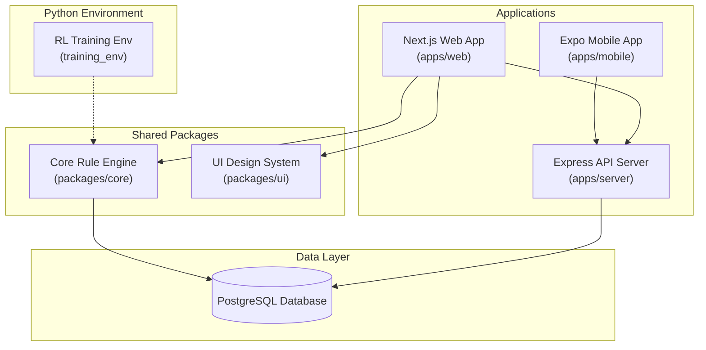

# 52Archive

Deck-only card game archive for web and iOS. A graph-based game design tool and browseable catalog for rule-set authors.

## Architecture



## Structure

| Path | Description |
|---|---|
| [apps/web](apps/web) | Next.js archive experience, catalog browser, and interactive game editor |
| [apps/server](apps/server) | Express + Socket.io API backend for persistence and collaborative locks |
| [apps/mobile](apps/mobile) | Expo iOS app (scaffold only) |
| [packages/core](packages/core) | Shared rule-graph engine, content model, DB client, CLI tools |
| [packages/ui](packages/ui) | Shared design tokens and visual theme |
| [training_env](training_env) | Python-based reinforcement learning game training environment |

## Getting Started

Follow these steps to spin up the local development workspace:

```bash
# 1. Start the Postgres database container
docker compose up -d db

# 2. Install workspace dependencies
npm install

# 3. Start the Express API backend server
npm run dev:server

# 4. Start the Next.js web application
npm run dev:web
```

To clean the Next.js build cache and restart the web app:
```bash
npm run dev:clean
```

## Routes

| Route | Purpose |
|---|---|
| `/` | Archive home page |
| `/games` | Full catalog browser — click any card to open the detail panel |
| `/editor` | Interactive game editor (rules schema form builder) |
| `/add` | Create a new game entry |
| `/judgement` | Dedicated Judgement game page |

## Editor Features (`/editor`)

The editor at `/editor` is a structured form-based game configuration builder. It is designed to construct valid rule sets matching the YAML schema parsed by both the web app and the reinforcement learning training pipeline.

- **Presets**: Load preset game templates (such as Whist, Spades, Oh Hell, or Judgement) as a starting point.
- **Rule Configurations**: Modify rules including player counts, distribution modes, bidding structures, card passing constraints, lead/follow rules, scoring types, and end-of-game conditions.
- **Dynamic YAML Generation**: Real-time generation and preview of the game schema YAML.
- **Locking System**: Session-based editing locks coordinate updates and prevent conflicting edits.
- **Admin & Training Integration**: Save configurations to the Postgres database, requesting admin review. Approved configurations are used by the reinforcement learning pipeline to train agent models.

### Saving and Persistence

The web editor connects to the backend API server (`apps/server`) to persist game rules and configurations inside the Postgres database. For offline draft updates, state is also saved to `localStorage` under the key `52archive_custom_games`.

## Database

The app runs on Postgres (via `docker-compose.yml`).

### Schema

| Table | Purpose |
|---|---|
| `games` | Public-facing game record (title, summary, metadata, moderation status) |
| `game_versions` | Versioned rule graphs, stored as JSONB |

Game lifecycle: `draft` -> `pending_review` -> `approved` (or `rejected`)

### CLI Tools

All tools run from the project root.

#### Push a YAML game definition to the database

```bash
npm run db:push-yaml -- path/to/game.yaml
```

This validates the YAML against the schema, upserts the game record, and inserts a new versioned graph snapshot.

Example:

```bash
npm run db:push-yaml -- judgement_game.yaml
npm run db:push-yaml -- graph_definition.yaml
```

#### Clear the database (reset to clean state)

```bash
npm run db:clear
```

Deletes all rows from `game_versions` and `games`. Use this to wipe test data and start fresh.

## npm Scripts

| Script | Description |
|---|---|
| `npm run dev:web` | Start the Next.js dev server |
| `npm run dev:server` | Start the Express API server |
| `npm run dev:clean` | Clear Next.js cache, then start dev server |
| `npm run dev:ios` | Start the Expo iOS app |
| `npm run db:push-yaml -- <file>` | Push a YAML game definition to Postgres |
| `npm run db:clear` | Wipe all games and versions from Postgres |
| `npm run typecheck` | Run TypeScript checks across all workspaces |
| `npm run lint` | Run lint across all workspaces |

## YAML Game Definition Format

See [judgement_game.yaml](judgement_game.yaml) and [graph_definition.yaml](graph_definition.yaml) for full examples.

Required top-level fields:

```yaml
id: my-game-id           # unique slug, no spaces
title: My Game
summary: One-line description
minPlayers: 2
maxPlayers: 6
playTimeMinutes: 30
difficulty: easy # easy, moderate, or hard
tags: [classic, strategy]
needsPaperScorekeeping: true
deckCount: 1

graph:
  nodes:
    - id: setup
      kind: setup
      title: Setup the table
      body: Shuffle and deal.
      x: 0
      y: 0
  edges:
    - id: e1
      from: setup
      to: turn
      label: begin
```

## Type Definitions

Key definitions are located in [types.ts](packages/core/src/types.ts):

```typescript
type GraphNode = {
  id: string;
  kind: string;       // setup | turn | score | end | branch | action
  title: string;
  body: string;
  x: number;
  y: number;
  stageKey?: string;
  aiHint?: string;
}

type GraphEdge = {
  id: string;
  from: string;
  to: string;
  label?: string;
  condition?: string;
}

type Game = {
  id: string;
  title: string;
  subtitle?: string;
  summary: string;
  minPlayers: number;
  maxPlayers: number;
  playTimeMinutes: number;
  difficulty: string;
  tags: string[];
  deckCount: number;
  needsPaperScorekeeping: boolean;
  graph: RuleGraph;
  featured: boolean;
}
```

## Known Limitations

- No user authentication; all games are currently unowned
- Mobile app is a scaffold with no game-specific content
- No undo/redo in the graph editor UI
- No edge or node deletion directly within the graph editor UI (must edit JSON/YAML source)

